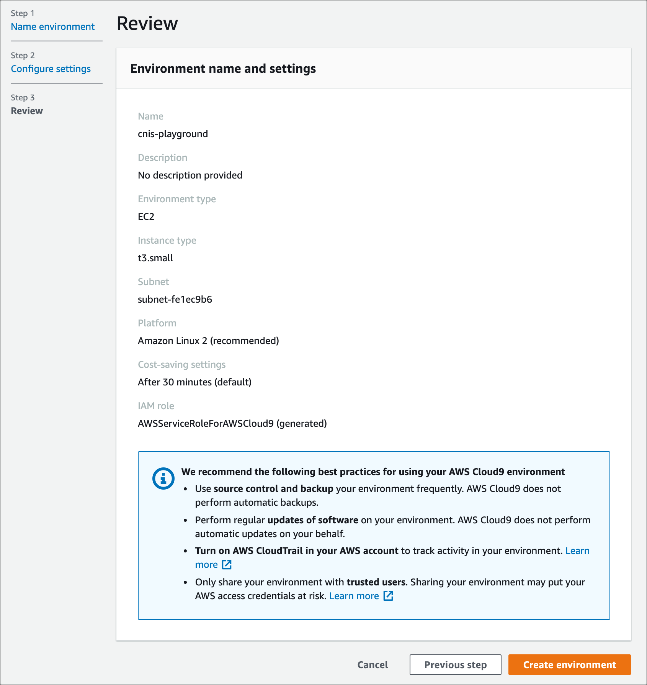

# クラウドネイティブIaCストーリー/サンプルコード

## Overview

本リポジトリでは「比べてわかる！IaCの選び方 ~クラウドネイティブIaCストーリー」の付録である各IaCのサンプルソースコードを提供しています。
また、Cloud9上でサンプルコードを動作させる手順も併せて記載していますので、AWSアカウントをお持ちの方はぜひハンズオン感覚でお試しください。

## サンプルコードの種類

|IaCサービス|言語/フォーマット|対象ディレクトリ|
|-|-|-|
|CloudFormation|YAML|[cloudformation](./cloudformation)|
|CDK|TypeScript|[cdk-typescript](./cdk-typescript)|
|Terraform|HCL|[terraform](./terraform)|
|Pulumi|Go|[pulumi-go](./pulumi-go)|

## サンプルコードの動作環境・バージョン情報

- CloudFormation: 2021年6月時点にAWS マネジメントコンソールから提供されるサービスバージョン
  - Template version: 2010-09-09

- AWS CDK: 1.106.1 (build c832c1b)
  - Node.js: v14.15.1

- Terraform: v1.0
  - tfenv: v2.2.2
  - AWS Provider: 3.45.0
  - Terragrant: v0.30.3

- Pulumi: v3.4.0
  - AWS Provider: v4.7.0
  - Go: 1.16.5


## 構築可能なAWS環境

いずれのIaCサービスサンプルコードを実行しても以下のAWSサービスが構築されます。


### 作成されるAWSサービス群

- Amazon VPC
  - Subnet (パブリック - AZ x 2)
  - Subnet (プライベートApp用 - AZ x 2)
  - Subnet (プライベートVPC Endpoint用 - AZ x 2)
  - Route Table (内部通信用)
  - VPC Endpoint(S3, CloudWatch Logs, ECR)
  - Security Group(ALB用)
  - Security Group(App用)
  - Security Group(VPC Endpoint用)
  - Internet Gateway
- Elastic Load Balancing
  - ALBリスナー
  - ターゲットグループ
- AWS IAM
  - Role (ECSタスク実行用)
  - Policy (ECSタスク実行用)
- AWS Systems Manager パラメータストア
- Amazon ECS
  - Cluster
  - Service
  - Task定義
- Amazon ECR リポジトリ
- Amazon CloudWatch Log Group

## ハンズオン実施に向けて
ここでは、本リポジトリで提供するIaCサービスをハンズオンとして実施するための準備事項を記載します。

### 前提事項
- AWSアカウントを所有していること
- AdministratorAccessポリシー相当のIAMユーザもしくはIAMロールで作業可能なこと

### 事前準備

IaCサービスの実行はAWS Cloud9上で行います。
ここではCloud9の作成と関連するセットアップ手順を記載します。

#### Amazon Cloud9の作成

各IaCサンプルコードを実行するためにCloud9を利用します。
デフォルトで各種言語のランタイムやDocker CLIが利用できるなど、メリットがあります。
早速、Cloud9用のインスタンスから作成します。

1. AWSマネジメントコンソール上部の [サービス] タブより [Cloud9] を選択します。
2. Cloud9ダッシュボードの左側ナビゲーションメニューから [Account environments] を選択し、[Create environment] ボタンを押します。
3. [Step1 Name environment] では、次のように各項目を入力後、 [Next step] ボタンを押します。

|項目名|値|
|-|-|
|Name|cnis-playground|
|Description|(入力なし)|

4. [Step2 Configure settings] では、次のように各項目を入力・選択後、 [Next step] ボタンを押します。
ネットワークVPC及びサブネットはデフォルトのものを選択してください（デフォルトVPCが存在しない場合、インターネットに接続可能なVPCとサブネットを選択してください）。

|項目名|値|
|-|-|
|Environment type|Create a new EC2 instance for environment(direct access)|
|Instance type|t3.micro(2 GiB RAM + 1 vCPU)|
|Platform|Amazon Linux2 (recommended)|
|Cost-saving setting|After 30 minutes(default)|
|Network(VPC)|vpc-xxxxxxx(default) ※インターネットに接続可能なVPC|
|Subnet|subnet-xxxxxxx | Default in ap-northeast-1a|

5. [Review] にて入力内容を確認し、 [Create environment] ボタンを押します。



6. 以下のようにCloud9コンソールが利用可能であることを確認してください。


#### IAMユーザーの作成

Cloud9ではマネジメントコンソールにログインしたIAMユーザーの権限で自動的に認証権限が設定される仕組みを持っています。
これは AWS Managed Temporary Credentials(以降「AMTC」と略します) と呼ばれています。

[AWS Managed Temporary Credentials](https://docs.aws.amazon.com/ja_jp/cloud9/latest/user-guide/how-cloud9-with-iam.html#auth-and-access-control-temporary-managed-credentials)

IAMロール等の付与等も不要であるため便利なのですが、以下のような制約があります。

[Actions Supported by AWS Managed Temporary Credentials](https://docs.aws.amazon.com/ja_jp/cloud9/latest/user-guide/how-cloud9-with-iam.html#auth-and-access-control-temporary-managed-credentials-supported)

今回は上記制約を回避するため、AMTCは無効化とし、別な権限からAWSCLIを実行できるようにします。
TerraformやPulumiではIAMユーザーアカウントから生成されるアクセスキーIDとシークレットアクセスキーが環境変数として設定されることを期待して動作します。
そのため、インスタンスプロファイルによるIAMロール付与ではなく、アクセスキーIDの設定を行います。

1. AWSマネジメントコンソールのトップ画面上部の [サービス] タブより [IAM] を 選択。
2. IAMダッシュボードの左側ナビゲーションメニューから [ユーザー] を選択し、表示画面上部の [ユーザーを追加] ボタンを押下。
3. ユーザーを追加画面にて次表の項目を選択後、[次のステップ:アクセス権限] ボタンを 押下。

|項目名|値|
|-|-|
|ユーザー名|cnis-user|
|アクセスの種類|プログラムによるアクセス|

4. ユーザーを作成画面にて、[既存のポリシーを直接アタッチ]を選択し、[AdministratorAccess] にチェックを入れた後、[次ののステップ:タグ] ボタンを押下。
5. ここではタグの追加はスキップ。[次のステップ:確認] ボタンを押下。
6. 確認画面にて、確認画面に表示された内容を確認し、[ユーザーの作成] ボタンを押下。
7. 成功の旨を確認し、表示されるアクセスキーIDとシークレットアクセスキーの値を控えておく。
　
#### AWSアクセスキーの設定

1. AWS マネジメントコンソールのトップ 画面上部の [サービス] タブより [Cloud9] を選択。
2. Cloud9 ダッシュボードの左側ナビゲーションメニューから [Your environments] を選択し、表示画面中央の cnapp-playground 内 [Open IDE] ボタンを押下。コンソールが表示されるまで待つ。

3. コンソール上で`~/.aws/credentials`を作成し、以下のように入力して保存。
```
[default]
aws_access_key_id=******
aws_secret_access_key=******
```

`aws_access_key_id`と`aws_secret_access_key`は、先程IAMユーザー作成時に払い出して作成したアクセスキーIDとシークレットアクセスキーを入力する。

4. コンソール上で`~/.aws/config`を作成し、以下のように入力して保存。
```
[profile default]
region = ap-northeast-1
```

以上でAWSアクセスキーの設定は完了です。
実際には、AWSアクセスキーをそのままフラットファイルに記載してしまうのは危険なので、[aws-vault](https://github.com/99designs/aws-vault)等と組み合わせて利用するのが実運用を考えると現実的です。
今回のハンズオンは簡略化のため、credentialsに記載しています。

#### AMTCの無効化

発行したAWSアクセスキーを利用するため、AMTCを無効化します。

1. AWS マネジメントコンソールのトップ 画面上部の [サービス] タブより [Cloud9] を選択。
2. Cloud9 ダッシュボードの左側ナビゲーションメニューから [Your environments] を選択し、表示画面中央の cnapp-playground 内 [Open IDE] ボタンを押下。コンソールが表示されるまで待つ。
3. 画面中央上部のタブの [+] ボタンを押し、[Open Preferences] を選択して新規タブを作成。タブ画面内の左側ナビゲーションメニューから [AWS Settings] → [Credentials] を選択。
4. 表示される画面上の [AWS managed temporary credentials:] を OFFに設定。


5. 以下のコマンドで作成した`cnis-user`の情報が返却できれば、AMTCではなくアクセスキーID経由でAWSCLIが実行できる状態。

```bash
$ aws iam list-users
{
    "Users": [
        {
            "UserName": "cnis-user", 
            "Path": "/", 
			:
        }, 
	:
}
```

以上により、Cloud9環境が整いました。

#### EBSボリュームサイズの変更

IaCによってはプロバイダーのダウンロードを行います。
Cloud9のデフォルトボリュームだとサイズが足りないので、別途EBSをアタッチします。

次のシェルファイルを作成します。名称は`resize.sh`としてください。

```shell: resize.sh
#!/bin/bash

# Specify the desired volume size in GiB as a command line argument. If not specified, default to 20 GiB.
SIZE=${1:-20}

# Get the ID of the environment host Amazon EC2 instance.
INSTANCEID=$(curl http://169.254.169.254/latest/meta-data/instance-id)
REGION=$(curl -s http://169.254.169.254/latest/meta-data/placement/availability-zone | sed 's/\(.*\)[a-z]/\1/')

# Get the ID of the Amazon EBS volume associated with the instance.
VOLUMEID=$(aws ec2 describe-instances \
  --instance-id $INSTANCEID \
  --query "Reservations[0].Instances[0].BlockDeviceMappings[0].Ebs.VolumeId" \
  --output text \
  --region $REGION)

# Resize the EBS volume.
aws ec2 modify-volume --volume-id $VOLUMEID --size $SIZE

# Wait for the resize to finish.
while [ \
  "$(aws ec2 describe-volumes-modifications \
    --volume-id $VOLUMEID \
    --filters Name=modification-state,Values="optimizing","completed" \
    --query "length(VolumesModifications)"\
    --output text)" != "1" ]; do
sleep 1
done

#Check if we're on an NVMe filesystem
if [[ -e "/dev/xvda" && $(readlink -f /dev/xvda) = "/dev/xvda" ]]
then
  # Rewrite the partition table so that the partition takes up all the space that it can.
  sudo growpart /dev/xvda 1

  # Expand the size of the file system.
  # Check if we're on AL2
  STR=$(cat /etc/os-release)
  SUB="VERSION_ID=\"2\""
  if [[ "$STR" == *"$SUB"* ]]
  then
    sudo xfs_growfs -d /
  else
    sudo resize2fs /dev/xvda1
  fi

else
  # Rewrite the partition table so that the partition takes up all the space that it can.
  sudo growpart /dev/nvme0n1 1

  # Expand the size of the file system.
  # Check if we're on AL2
  STR=$(cat /etc/os-release)
  SUB="VERSION_ID=\"2\""
  if [[ "$STR" == *"$SUB"* ]]
  then
    sudo xfs_growfs -d /
  else
    sudo resize2fs /dev/nvme0n1p1
  fi
fi
```

resizeシェルを実行してディスク容量を確保します。`data blocks changed`と表示されればOKです。再度dfコマンドを実行し、ディスクの空き領域が増えていることも確認しておきます。

```bash: resizeシェルの実行
$ ls
resize.sh

$ sh resize.sh 30
・・・
data blocks changed from 2620923 to 7863803

$ df -h
Filesystem      Size  Used Avail Use% Mounted on
devtmpfs        474M     0  474M   0% /dev
tmpfs           492M     0  492M   0% /dev/shm
tmpfs           492M  456K  492M   1% /run
tmpfs           492M     0  492M   0% /sys/fs/cgroup
/dev/xvda1       30G  8.1G   22G  27% /
tmpfs            99M     0   99M   0% /run/user/1000
```

#### 各種ツールのインストール

再びCloud9コンソールに戻り、以下をインストールしておきます。
```
$ sudo yum -y install tree jq
```

### リポジトリの取得

Cloud9上で実行する本リポジトリを取得します。

1. Cloud9 IDEを開き、画面下部のコマンドラインにて以下を入力。

```
$ git clone https://github.com/uma-arai/iac-story-code
Cloning into 'iac-story-code'...
:
Resolving deltas: 100% (172/172), done.
```

2. リポジトリがクローンされていることを確認。
```
$ cd iac-story-code/
$ tree .
```

これで各サンプルコードを実行する準備が出来ました。

## 各IaCサービスのハンズオン

本リポジトリの各IaCサービスディレクトリ配下の`README.md`に従って実施してください。

## 注意事項

- 本リポジトリは不定期にバージョンアップを行います。READMEのバージョン情報を適宜ご参照ください。
- IaCサービス利用により、以下のAWSサービスが作成されます。料金が発生するサービスも含まれており、各IaCサービス用 README.md に従ってリソースの削除をオススメします。
  - リソースを作成したまま1ヶ月放置すると、東京リージョン(ap-northeast-1)で**約¥13,000程度請求されてしまう**ので、消し忘れにご注意ください($1=¥110換算、消費税なし)。


## 免責事項

- 本リポジトリ（以降、`iac-story-code`）は利用者ご自身の判断と責任において行われるものとします。

- `iac-story-code`の各種情報等については、慎重に作成、管理し、正確性を保つようには努めていますが、万一記載情報が事実と異なる場合は、Issueを作成していただけると幸いです。

- `iac-story-code`の内容の全部または一部を事前の告知なしに変更する場合があります。

- `iac-story-code`上から入手された情報により発生したあらゆる損害に関して一切の責任を負いません。 ここに掲載する情報およびリンクが設定されている他のサイトから取得された各種情報の利用によって生じたあらゆる損害に関しても一切の責任を負いません。

- `iac-story-code`にに登場するシステム名や製品名は、関係各社の商標または登録商標です。また本書では、™、®、©などのマークは省略しています。