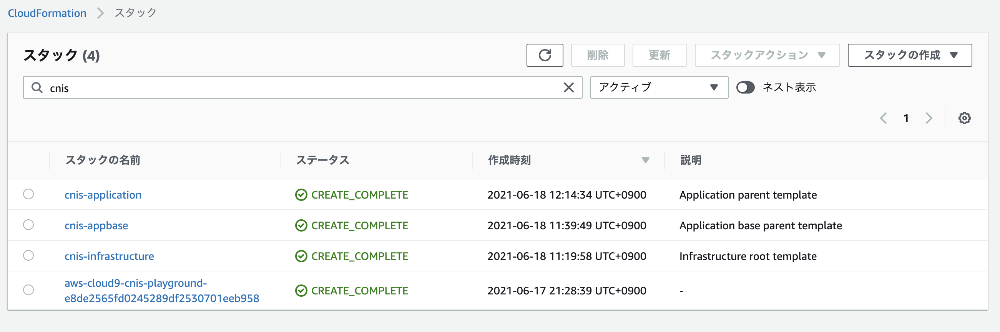
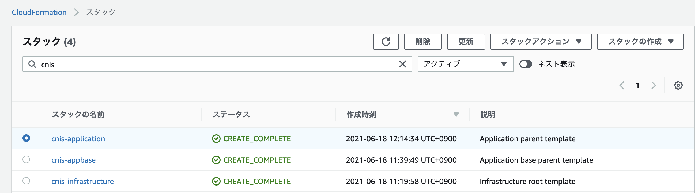

# CloudFormation 

## Overview
ここではCloudFormationのサンプルコードを提供します。
以下README.mdの内容に従って、CloudFormationを実行することができます。

## 前提事項
- リポジトリ直下のREADME.mdによる環境準備が完了していること。

## セットアップ

### ツールのバージョン

本書でも説明したとおり、CloudFormationのメリットはJSON/YAMLが記述できるエディタさえあれば、追加のツールなしでも実行できる点です。

本ハンズオンでももちろん、提供するYAMLをそのままCloudFormationダッシュボードからアップロードするだけで実行も可能です。

しかし、毎回GUIを操作してファイルをアップロードすることも手間です。
本ハンズオンでは**AWS CLI**を利用してCloudFormationのスタックを作成します。

Cloud9にはデフォルトでAWS CLIがインストールされており、追加の設定は不要です。
AWS CLIのバージョンは次のとおりです。

```bash
$ aws --version
aws-cli/1.19.94 Python/2.7.18 Linux/4.14.232-176.381.amzn2.x86_64 botocore/1.20.94
```

### テンプレート格納用S3の作成

```bash
# アカウントIDの取得
$ AWS_ACCOUNT_ID=$(aws sts get-caller-identity --query 'Account' --output text)
# バケット名の設定
$ BUCKET_NAME=cnis-cfn-bucket-${AWS_ACCOUNT_ID}
# リージョン名の設定
$ REGION=ap-northeast-1
# S3の作成とパブリックアクセスの禁止設定
$ aws s3api create-bucket \
    --bucket ${BUCKET_NAME} \
    --region ${REGION} \
    --create-bucket-configuration LocationConstraint=${REGION}
$ aws s3api put-public-access-block \
    --bucket $BUCKET_NAME \
    --public-access-block-configuration "BlockPublicAcls=true,IgnorePublicAcls=true,BlockPublicPolicy=true,RestrictPublicBuckets=true"
```

## CloudFormationの実行

いよいよサンプルソースコードを利用してAWSリソースを作成します。
今回、CloudFormationでは3つのスタックを用意しています。

| スタック           | 内容                                 |
|----------------|------------------------------------|
| infrastructure | VPC、サブネットなどネットワーク周りやライフサイクルが長いリソース |
| app-base       | ECRなどアプリに必要なベースリソース                |
| application    | ECSサービスなどアプリに必要なリソース               |

それぞれのテンプレートからスタックを作成して、リソースをデプロイします。

### NestしたテンプレートをS3にアップロード

サンプルコードではフラットにCloudFormationを記述するのではなく、Nested Stackを利用しています。親となるスタックからNestされたスタックを利用するためにはテンプレートのURLを指定します。S3にNestしたテンプレートを格納し、S3のURLを指定することとします。

```bash
$ aws s3 cp infrastructure/ s3://${BUCKET_NAME}/infra --recursive
upload: infrastructure/iam.yml to s3://[BUCKET_NAME]/infra/iam.yml
︙

$ aws s3 cp appbase/ s3://${BUCKET_NAME}/appbase --recursive
upload: appbase/ecr.yml to s3://[BUCKET_NAME]/appbase/ecr.yml 

$ aws s3 cp application/ s3://${BUCKET_NAME}/application --recursive
upload: application/cloudwatch.yml to s3://[BUCKET_NAME]/app/cloudwatch.yml
upload: application/alb.yml to s3://[BUCKET_NAME]/application/alb.yml 
upload: application/ecs.yml to s3://[BUCKET_NAME]/application/ecs.yml
```

### infrastructureスタックのデプロイ

`infrastructure.yml`を開き、8行目の[AWS_ACCOUNT_ID]を自身のAWSアカウントIDに書き換えてください。

```text
1	AWSTemplateFormatVersion: "2010-09-09"
2	Description: Infrastructure parent template
3
4	Parameters:
5	  Template:
6	    Description: Template URL for each yml file
7	    Type: String
8	    Default: https://cnis-cfn-bucket-[AWS_ACCOUNT_ID].s3.ap-northeast-1.amazonaws.com/infra
9
```

AWS CLIからスタック作成を実行します。

```bash
$ pwd
/home/ec2-user/environment/iac-story-code/cloudformation

# IAMの作成を伴うのでcapabilitiesの指定が必要
$ aws cloudformation create-stack --stack-name cnis-infrastructure --template-body file://infrastructure.yml --capabilities CAPABILITY_NAMED_IAM                                                                                         
{
    "StackId": "arn:aws:cloudformation:ap-northeast-1:xxxxxxxx:stack/cnis-infrastructure/addb4cf0-cfdb-11eb-8dff-0e9cfcf32e9f"
}
```

### app-baseスタックのデプロイ

`app-base.yml`を開き、8行目の[AWS_ACCOUNT_ID]を自身のAWSアカウントIDに書き換えてください。

```text
1	AWSTemplateFormatVersion: "2010-09-09"
2	Description: Application base parent template
3
4	Parameters:
5	  Template:
6	    Description: Template URL for each yml file
7	    Type: String
8	    Default: https://cnis-cfn-bucket-[AWS_ACCOUNT_ID].s3.ap-northeast-1.amazonaws.com/appbase
9
```

AWS CLIからスタック作成を実行します。

```bash
$ pwd
/home/ec2-user/environment/iac-story-code/cloudformation

$ aws cloudformation create-stack --stack-name cnis-appbase --template-body file://app-base.yml
{
    "StackId": "arn:aws:cloudformation:ap-northeast-1:
    xxxxxxxx:stack/cnis-appbase/73de9b30-cfde-11eb-8a91-0e2c15a96cb9"
}
```

### ECRへのアプリコンテナ登録

作られたAWSリソースにおいて、ECSはECRからコンテナイメージを取得してデプロイするのですが、
現状ではECRにコンテナが登録されていません。
そこで、次に従ってサンプルアプリをコンテナビルドし、ECRに対してプッシュします。

```bash
# Dockerビルドにてコンテナイメージを作成
$ cd ~/environment/iac-story-code/app/
$ export CONTAINER_NAME="cnisapp"
$ export CONTAINER_TAG="init"
$ docker build -t ${CONTAINER_NAME}:${CONTAINER_TAG} .
Sending build context to Docker daemon  11.82MB
Step 1/14 : FROM golang:1.16.5-alpine3.13 AS build-env
1.16.5-alpine3.13: Pulling from library/golang
:
Successfully built 7aa88fd39158
Successfully tagged cnisapp:v1

# ECRにログインしてコンテナイメージをプッシュ
$ export AWS_ACCOUNT_ID=`aws sts get-caller-identity | jq .Account -r`
$ $(aws ecr get-login --no-include-email --registry-ids ${AWS_ACCOUNT_ID} --region ap-northeast-1)

$ AWS_ECR_URL=`aws ecr describe-repositories | jq .repositories[].repositoryUri -r | grep cnis-ecr-app`; docker tag ${CONTAINER_NAME}:${CONTAINER_TAG} ${AWS_ECR_URL}:${CONTAINER_TAG}

$ docker push ${AWS_ECR_URL}:${CONTAINER_TAG}

# プッシュしたイメージ内容の確認
$ AWS_ECR_REPO_NAME=`aws ecr describe-repositories | jq .repositories[].repositoryName -r | grep cnis`; aws ecr describe-images --repository-name $AWS_ECR_REPO_NAME
```

以上でデプロイするコンテナイメージがECRに登録できました。

### applicationスタックのデプロイ

`application.yml`を開き、8行目の[AWS_ACCOUNT_ID]を自身のAWSアカウントIDに書き換えてください。

```text
1	AWSTemplateFormatVersion: "2010-09-09"
2	Description: Application parent template
3
4	Parameters:
5	  Template:
6	    Description: Template URL for each yml file
7	    Type: String
8	    Default: https://cnis-cfn-bucket-[AWS_ACCOUNT_ID].s3.ap-northeast-1.amazonaws.com/application
9
```

AWS CLIからスタック作成を実行します。

```bash
$ pwd
/home/ec2-user/environment/iac-story-code/cloudformation

$ aws cloudformation create-stack --stack-name cnis-application --template-body file://application.yml                                                                           
{
    "StackId": "arn:aws:cloudformation:ap-northeast-1:xxxxxxxx:stack/cnis-infrastructure/addb4cf0-cfdb-11eb-8dff-0e9cfcf32e9f"
}
```

## アプリのデプロイ確認

続けて、以下コマンドによりプッシュしたコンテナがECS上にデプロイされるか確認します。
デプロイが完了すると、以下のようにECSタスクのARNが返却されます。
```bash
$ while true; do aws ecs list-tasks --cluster cnis-ecs-cluster-app; sleep 10; done
{
    "taskArns": []
}
{
    "taskArns": []
}
:
{
    "taskArns": [
        "arn:aws:ecs:ap-northeast-1:123456789012:task/cnis-ecs-cluster-app/8e2be702a59a4d5d9847b0f1cfdb52b0"
    ]
}
# Ctel+C で停止
```

## アプリの疎通確認

デプロイされたアプリに対してリクエストを送ります。
```bash
$ export APP_FQDN=`aws elbv2 describe-load-balancers | jq .LoadBalancers[].DNSName -r | grep cnis-`
$ curl http://${APP_FQDN}/cnis/v1/helloworld
"Hello world!"
```

ハローワールドのレスポンスが返ってきました！
IaCから作成されたアプリが正常稼働していそうです。
続けて、Systems Manager パラメータストアに格納された値がアプリの環境変数として取り込まれているので、
その値を取得してみましょう。

まずはパラメータストアの値を見てみます。

```bash
$ aws ssm get-parameter --name cnis-ssm-param-cnis-app | jq .Parameter.Value -r
Cloud Native IaC Story
```

"Cloud Native IaC Story"という値が設定されていますね。
続けてデプロイアプリに対してリクエストを行います。

```bash
$ curl http://${APP_FQDN}/cnis/v1/param
"Cloud Native IaC Story"
```

同じ文字列が返却されました！
IaCから作成されたECSやSSMパラメータストアを通して、アプリが稼働する一連のAWSリソースを作成できました。

以上でハンズオンは終了です。
ぜひ、こちらのIaCサンプルコードを活用して、自分達のIaCサービスに活用していってください。

## 後片付け

作成したAWSリソースを順番に削除していきます。

### ECRのコンテナイメージの削除

ECRにコンテナイメージが残っている状態でリポジトリを削除しようとすると次のエラーが発生します。
エラーメッセージでは「このリポジトリにコンテナイメージが含まれているから削除できません」という内容です。

```
Resource handler returned message: "The repository with name 'cnis-ecr-app' in registry with id 'xxxxxxx' cannot be deleted because it still contains images
```

Cloud9から次のコマンドを実行してECRに格納されているイメージを削除します。

```bash
$ aws ecr batch-delete-image \
--repository-name cnis-ecr-app \
--image-ids imageTag=init

{
    "failures": [], 
    "imageIds": [
        {
            "imageTag": "init", 
            "imageDigest": "sha256:759116eef9c1d191dc83a574220a9052a6af555dac6a369da7cb8b5ce8563e13"
        }
    ]
}
```

`failures`が空となっていれば完了です。ECRのダッシュボードでコンテナイメージが削除され、イメージが存在しないことを確認してください。

### AWSリソースの削除

AWS マネジメントコンソールから削除していきましょう。
まず、CloudFormationのダッシュボードへ遷移します。



3つのリソース生成用スタックと、1つのCloud9用のスタックがあります。
リソース生成用スタックを`cnis-application`→`cnis-appbase`→`cnis-infrastructure`の順に削除していきましょう。
`cnis-application`はECSサービスの削除となり、時間がかかります。筆者が実施した際は7分ほどかかりました。気長に待ちましょう。



### テンプレート格納用S3の削除

1. AWSマネジメントコンソール上部の [サービス] タブより [S3] を選択。
2. S3ダッシュボードの左側ナビゲーションメニューから [バケット] を選択。
3. バケット一覧から[cnis-cfn-bucket-[AWSアカウントID]] を選択し、[空にする] ボタンを押下。
4. バケットを空にする画面にて、テキストフィールドに[完全に削除] と入力し、[空にする] ボタンを押下。
5. 正常に空になったことを確認し、[終了] ボタンを押下。
6. バケット一覧から[cnis-cfn-bucket-[AWSアカウントID]] を選択し、[削除] ボタンを押下。
7. バケットを空にする画面にて、テキストフィールドにバケット名を入力し、[バケットを削除] ボタンを押下。
8. 正常に削除されたことを確認。


## 補記
- 2021年6月現在、CloudFormation にはCloudFormation Modulesが用意されていますが、今回は利用しません。
    - テンプレートよりさらに細かい粒度のモジュールを定義できる機能です。
        - 2021年4月にYAMLがサポートされてようやく書ける体制が整いつつある状態です。
            - https://aws.amazon.com/jp/about-aws/whats-new/2021/04/aws-cloudformation-modules-provides-yaml-delimiter-support/
    - モジュール利用のためには事前にCloudFormation レジストリへのモジュール登録が必要です。
        - モジュール登録がかなり手間で微妙なので今回は利用を見送りました。


